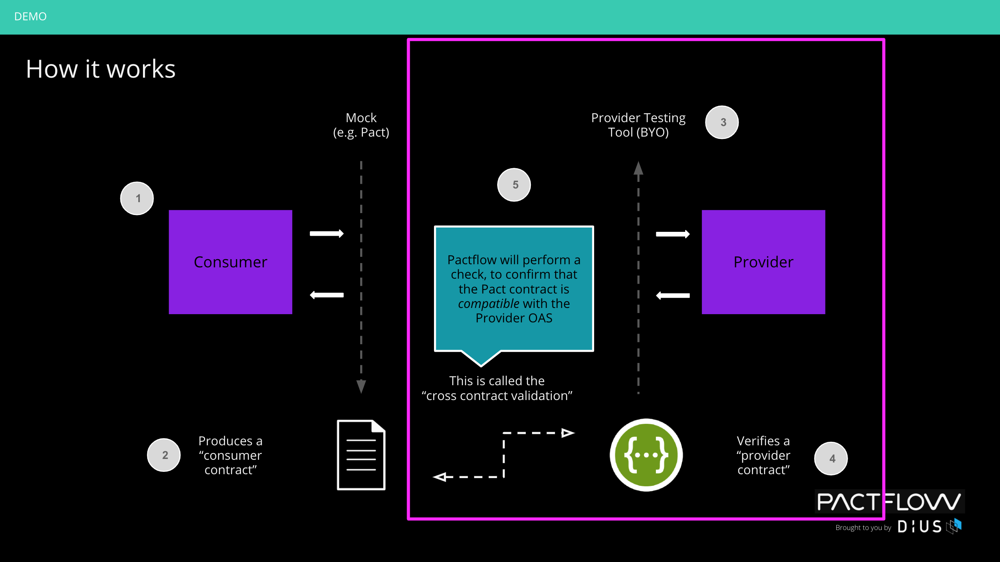

# Example NodeJS Provider - ReadyAPI

<!-- Build Badge -->

<!-- Can I Deploy Badge -->

- [Example NodeJS Provider - ReadyAPI](#example-nodejs-provider---readyapi)
  - [Overview of Example](#overview-of-example)
    - [Key points](#key-points)
  - [Overview of Part of Bi-Directional Contract Testing Flow](#overview-of-part-of-bi-directional-contract-testing-flow)
  - [Compatibile with Consumers](#compatibile-with-consumers)
  - [Pre-requisites](#pre-requisites)
    - [Environment variables](#environment-variables)
  - [Usage](#usage)
    - [Steps](#steps)
  - [OS/Platform specific considerations](#osplatform-specific-considerations)
  - [Related topics / posts / discussions](#related-topics--posts--discussions)
  - [Found an issue?](#found-an-issue)

## Overview of Example

<!-- Provider Overview -->

This is an example of a NodeJS "Product" API Provider that uses ReadyAPI, Pact, [Pactflow](https://pactflow.io) and GitHub Actions to generate and publish Pact provider contracts.

It performs pre-deployment cross-compatability checks to ensure that it is compatible with specified consumers using the Bi-Directional contract capability of Pactflow.

<!-- General -->

See the full [Pactflow Bi-Directional Workshop](https://docs.pactflow.io/docs/workshops/bi-directional-contract-testing) for which this can be substituted in as the "provider".

### Key points

It:

- Is an API written in Express JS
- Has a ReadyAPI Project (see `Project-1-readyapi-project.xml`) generated from an OpenAPI specification
- Uses ReadyAPIs API testing capabilities to create test suites/cases from the OpenAPI specification
- Uploads the OpenAPI spec and ReadyAPI results to Pactflow

What is uploaded to Pactflow is an OpenAPI specification that represents what you actually tested with ReadyAPI, to give us confidence it is compatible with a Pact consumer.

## Overview of Part of Bi-Directional Contract Testing Flow

<!-- Provider Overview -->

In the following diagram, you can see how the provider testing process works.

When we call "can-i-deploy" the cross-contract validation process kicks off on Pactflow, to ensure any consumer consumes a valid subset of the OAS for the provider.

The project uses a Makefile to simulate a very simple build pipeline with two stages - test and deploy.

When you run the CI pipeline (see below for doing this), the pipeline should perform the following activities (simplified):

- Test
  - Run tests to check spec compliance with openAPI spec
  - Create branch tag via Pact CLI
  - Publish openAPI spec, along with a version with the name of the current branch
  - Check if we are safe to deploy to Production with `can-i-deploy` (ie. has the cross-contract validation has been successfully performed)
- Deploy (only from <main|master>)
  - Deploy app to Production
  - Record the Production deployment in the Pact Broker
  -

## Compatibile with Consumers

<!-- Consumer Compatability -->

This project is currently compatible with the following consumers(s):

- [pactflow-example-bi-directional-consumer-nock](https://github.com/pactflow/example-bi-directional-consumer-nock)
- [pactflow-example-bi-directional-consumer-msw](https://github.com/pactflow/example-bi-directional-consumer-msw)
- [pactflow-example-bi-directional-consumer-wiremock](https://github.com/pactflow/example-bi-directional-consumer-wiremock)
- [pactflow-example-bi-directional-consumer-mountebank](https://github.com/pactflow/example-bi-directional-consumer-mountebank)
<!-- * [pactflow-example-bi-directional-consumer-dotnet](https://github.com/pactflow/example-bi-directional-consumer-dotnet) -->

See [Environment variables](#environment-variables) on how to set these up

## Pre-requisites

**Software**:

- Tools listed at: https://docs.pactflow.io/docs/workshops/ci-cd/set-up-ci/prerequisites/
- A pactflow.io account with an valid [API token](https://docs.pactflow.io/docs/getting-started/#configuring-your-api-token)

### Environment variables

To be able to run some of the commands locally, you will need to export the following environment variables into your shell:

- `PACT_BROKER_TOKEN`: a valid [API token](https://docs.pactflow.io/docs/getting-started/#configuring-your-api-token) for Pactflow
- `PACT_BROKER_BASE_URL`: a fully qualified domain name with protocol to your pact broker e.g. https://testdemo.pactflow.io

## Usage

### Steps

- `make install` - install project dependencies

Run each step separately

- `make test_and_publish` - tests the provider and publishes provider contracts to Pactflow
  - This will perform the following 2 calls
    - `make test`
    - `make publish_provider_contract`
- `make can_i_deploy` - runs can-i-deploy to check if its safe to deploy the provider
- `make deploy` - deploys the app and records deployment

or run the whole lot in one go

- `make ci` - run the CI process, but locally (uses Docker by default)

Installing alternate pact CLI tools.

If you don't have docker, you can use one of the ruby tools. The standalone, doesn't require that you install Ruby on your host machine.

- `make install-pact-ruby-cli` - installs the pact ruby CLI tool
- `make install-pact-ruby-standalone` - installs the pact standalone CLI depending on your platform
- `make uninstall-pact-ruby-standalone` - uninstalls the pact standalone CLI

Using alternate pact CLI tools.

- `PACT_TOOL=docker make ci` - run the CI process, using the pact Docker CLI tool
- `PACT_TOOL=ruby_standalone make ci` - run the CI process, using the pact standalone CLI tool
- `PACT_TOOL=ruby_cli make ci` - run the CI process, using the pact ruby CLI tool

## OS/Platform specific considerations

The makefile has been configured to run on Unix/Windows and MacOS based systems, and tested against Github Actions

They can be run locally on Unix/Windows and MacOS, or on Windows via [WSL2](https://docs.microsoft.com/en-us/windows/wsl/install) or a shell with bash.

## Related topics / posts / discussions

- [Consumer Side Bi-Directional Contract Testing Guide](https://docs.pactflow.io/docs/bi-directional-contract-testing/consumer)
- [Provider Side Bi-Directional Contract Testing Guide](https://docs.pactflow.io/docs/bi-directional-contract-testing/provider)

## Found an issue?

Reach out via a GitHub Issue, or reach us over in the [Pact foundation Slack](https://slack.pact.io)
